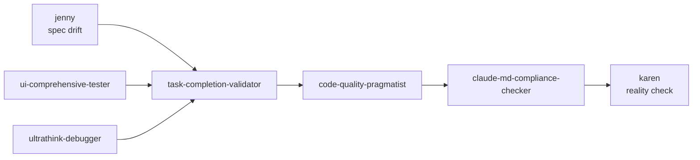

# Claude Code Agents Collection

[](LICENSE)

Seven specialized subagent definitions for [Claude Code](https://docs.claude.com/en/docs/claude-code/sub-agents), Anthropic's AI-powered coding assistant. Each agent is a drop-in markdown file that extends Claude Code with a focused, well-scoped role.

## Agents at a glance

| Agent | Role | Tools |
| --- | --- | --- |
| [@jenny](jenny.md) | Spec ↔ implementation auditor (independently verifies what's built matches the written spec) | Read, Grep, Glob, Bash |
| [@karen](karen.md) | Project reality manager (cuts through claimed-vs-actual completion and writes a pragmatic finish plan) | Read, Grep, Glob |
| [@claude-md-compliance-checker](claude-md-compliance-checker.md) | Enforces rules from the project's `CLAUDE.md` | Read, Grep, Glob |
| [@code-quality-pragmatist](code-quality-pragmatist.md) | Anti-over-engineering reviewer | Read, Grep, Glob |
| [@task-completion-validator](task-completion-validator.md) | "Is this claimed completion actually functional end-to-end?" | Read, Grep, Glob, Bash |
| [@ui-comprehensive-tester](ui-comprehensive-tester.md) | Web/mobile UI testing via Puppeteer/Playwright/Mobile MCP | Read, Grep, Glob, Bash (+ MCP) |
| [@ultrathink-debugger](ultrathink-debugger.md) | Deep root-cause debugger for complex/production/intermittent bugs | Read, Grep, Glob, Bash |

## Which agent do I need?

| Scenario | Use |
| --- | --- |
| "Someone said the feature is done — verify it" | `@task-completion-validator` |
| "Does the code match the spec / CLAUDE.md?" | `@jenny` |
| "What's the real state of this project?" | `@karen` |
| "Did my recent change violate project rules?" | `@claude-md-compliance-checker` |
| "Is this code overengineered?" | `@code-quality-pragmatist` |
| "Test the UI across web/mobile" | `@ui-comprehensive-tester` |
| "Bug I can't figure out" | `@ultrathink-debugger` |

### Quick differentiation: Jenny vs task-completion-validator vs Karen

- **Jenny** → *spec-to-code drift* ("does the code match the written requirements?")
- **task-completion-validator** → *claim-to-reality drift* ("is the claimed-complete feature actually working?")
- **Karen** → *portfolio-level reality check* ("given everything, what's the real state of the project and the minimum plan to finish?")

## Install

Copy the agent files into a Claude Code agents directory. User scope (available in every project) is the common choice:

```bash
# User-scoped install
mkdir -p ~/.claude/agents
for f in jenny karen claude-md-compliance-checker code-quality-pragmatist \
         task-completion-validator ui-comprehensive-tester ultrathink-debugger; do
  cp "$f.md" ~/.claude/agents/
done
```

Or project-scoped (only in the current repo):

```bash
mkdir -p .claude/agents
for f in jenny karen claude-md-compliance-checker code-quality-pragmatist \
         task-completion-validator ui-comprehensive-tester ultrathink-debugger; do
  cp "$f.md" .claude/agents/
done
```

Restart your Claude Code session after installing so the new subagents are picked up.

### Prerequisites per agent

- **`ui-comprehensive-tester`** additionally requires a UI testing MCP server (Puppeteer, Playwright, or Mobile) to actually drive browsers/devices. See the agent file's *Prerequisites* section.
- **`ultrathink-debugger`** is configured with `Bash` tool access so it can run reproductions; review before enabling in locked-down environments.

## Use

Inside a Claude Code session, invoke an agent by name:

```
@karen give me a realistic assessment of this sprint
@jenny audit whether our auth module matches CLAUDE.md spec
@task-completion-validator verify PR #142
@ultrathink-debugger the /api/sessions endpoint 500s only for tenant X
```

## How agent chaining works

Several of the agents suggest "next agent" chains at the end of their output (for example, `@task-completion-validator` recommends running `@jenny` and `@code-quality-pragmatist` after it rejects a completion).

> **Chaining is manual.** Claude Code does not automatically invoke one subagent from another. The `@agent-name` references in these files are *recommendations* — the primary agent or the user must explicitly invoke each next agent.

Intended chain for a full review:



## Shared output schema

All agents aim to emit a consistent output shape so results are composable:

- **Status:** `APPROVED` | `REJECTED` | `ADVISORY`
- **Issues:** each tagged with severity (`Critical` | `High` | `Medium` | `Low`) and a `path:line` reference
- **Recommendations:** ordered, actionable
- **Next agents:** suggested `@agent` follow-ups (invoke manually — see above)

File and line references use the shared format `file_path:line_number`.

## Contributing

See [CONTRIBUTING.md](CONTRIBUTING.md) and the agent starter skeleton in [TEMPLATE.md](TEMPLATE.md).

## Security

See [SECURITY.md](SECURITY.md) for the threat model (notably prompt-injection risk when agents read untrusted repository content) and how to report vulnerabilities.

## License

[MIT](LICENSE).
